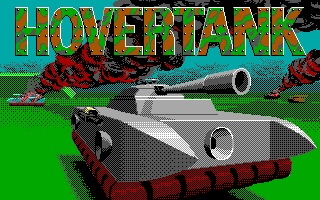

For the first piece of actual reverse engineering [on this project](../dave-2-port/) I was going to take a look at assets. There were a few reasons this seemed like a good entry point given my limited experience with reverse engineering techniques:

1. Dave 2 was written around 1990–91, so image formats and compression algorithms are likely to be relatively simple or bespoke.
2. The file listing clearly shows game assets (levels, sprites, splash images etc.) and filename strings are likely embedded in the executable. Finding references to these strings should be straightforward.
3. Decoding and displaying assets felt like a quick way to start writing useful code and make real progress.

I had also started looking for resources on Dave 2 to see if anyone else had attempted any reverse engineering efforts before. I found several really good references:

The first is the [Dangerous Dave 2](https://moddingwiki.shikadi.net/wiki/Dangerous_Dave_2) page on the DOS Game Modding Wiki. Some juicy bits here, if a little sparse on detail. Had I found this resource before the [last article](../dave-2-2-unpack/), I would have found a little shortcut:

> [...] the executable is compressed with LZ compression, and can be uncompressed with UNLZEXE.

The second resource was this [detailed breakdown of Dave 2 assets](https://github.com/gmegidish/dangerous-dave-re) from 2006 by Gil Megidish. This was a solid gold find, and much of the progress described in this post is based on details provided by Gil.



One final, and quite obscure resource I found was the source code for [Hovertank 3D](https://github.com/FlatRockSoft/Hovertank3D), specifically the files `IDLIB.C` and `IDLIB.H`. This was a game published later in 1991 by then id Software.

What led me here was a random Google search for the string `"BloadinMM"`[^1] which was in a file loading routine in the Dave executable. It seemed likely that some of these routines also shipped in Dave 2.

## Compression

From Gil's breakdown we know that aside from the self-extracting executable, there are 2 asset compression formats at play: Huffman encoding and RLEW. And we can see that the Hovertank 3D source has [routines](https://github.com/FlatRockSoft/Hovertank3D/blob/86f6b5ed34c52d2ca8acbb26391ebd5b2542f1fa/IDLIBC.C#L809) for [each](https://github.com/FlatRockSoft/Hovertank3D/blob/86f6b5ed34c52d2ca8acbb26391ebd5b2542f1fa/IDLIBC.C#L1081).

Both formats were commonly used in early id Software engines. [Huffman encoding](https://en.wikipedia.org/wiki/Huffman_coding) compresses arbitrary byte streams using a variable-length bit representation, while RLEW ([Run-Length Encoded](https://en.wikipedia.org/wiki/Run-length_encoding) Words) is a simple word-oriented run-length encoding typically used for tile maps.

I had found a cheat sheet, so implementing both of these was a nice easy way to get started with my codebase. The only question was how I was going to validate the result.

## DOSBox-X debugger

Alongside Ghidra, the DOSBox-X debugger has become an essential tool in my reverse engineering efforts. While its ncurses-based UI is less than stellar, it offers enough features for stepping through code, setting breakpoints and inspecting memory, that we can very quickly validate learnings made from the disassembly.

In this case, I wanted to be able to validate the output of my Huffman and RLEW decoders, so I needed to know where in memory these bytes would be stored after they were loaded from disk and decompressed.

### Finding the output

While Ghidra arbitrarily starts the Code Segment at `0x1000`, DOSBox-X will likely load the program at a different segment each run. Thankfully, debugger addresses use `CS` and `DS` [^2] to reference the current register values, and instruction offsets remain consistent. So once I locate an instruction I want to break on in Ghidra, it's easy enough to copy the offset over to DOSBox-X:

```shell
# Set a breakpoint at the instruction CS:10CA
> BP CS:10CA

# Move the memory inspector to 0x5360 in the data segment
> D DS:5360
```

It was just a matter of finding a suitable breakpoint near the decoding routines, and inspecting the memory to validate results. Recall earlier we found the Hovertank source code via the string `BloadinMM`; well immediately after at `DS:2c8e` is the string `HUFF`. And we know from the Hovertank 3D source, and from inspecting the Dave 2 asset files, that Huffman-encoded assets begin with these four bytes.

I looked for references to `2c8e` by searching for the hex string, and found a single result, this function call at `1000:7cb3`:

```asm
...
1000:7ca7 b8 04 00        MOV        AX,0x4
1000:7caa 50              PUSH       AX
1000:7cab b8 8e 2c        MOV        AX,0x2c8e
1000:7cae 50              PUSH       AX
1000:7caf 8d 46 fc        LEA        AX=>local_6,[BP + -0x4]
1000:7cb2 50              PUSH       AX
1000:7cb3 e8 a2 4d        CALL       FUN_1000_ca58
1000:7cb6 83 c4 06        ADD        SP,0x6
...
```

This is a cdecl calling convention[^3], where the caller is pushing function arguments onto the stack from right to left before calling to the function itself. The decompilation in Ghidra showed:

```c
iVar2 = FUN_1000_ca58(&stack0xfffa, (char *)s_HUFF_3713_2c8e, 4);
if (iVar2 != 0) {
  FUN_1000_063b((byte *)s_Tried_to_expand_a_file_that_isn'_3713_2c93);
}
```

So we're calling a function, passing a stack value as an address, passing our `HUFF` string and finally the immediate value 4. If this function returns non-zero then call to another function with the string "Tried to expand a file that isn't HUFF!". We can make some confident assumptions from this:

1. `FUN_1000_ca58` is highly likely to be a `strcmp` style function. The third parameter strengthens this claim as it's likely to be a length value.
2. The first parameter is therefore likely to be a pointer to our file bytes.
3. The function we're in is therefore probably our huffman decoding routine.

And looking at the [Hovertank](https://github.com/FlatRockSoft/Hovertank3D/blob/86f6b5ed34c52d2ca8acbb26391ebd5b2542f1fa/IDLIBC.C#L889) source, I was able to confirm these assumptions — this assembly was likely to be compiled from very similar if not the same source.

Scrolling to the top of this function and looking at the `XREF` section, I could see a single caller — we've found our breakpoint, if we break on the return instruction at `1000:7be9` that should be immediately after our input file has been decoded.

### Finding the buffers

With a breakpoint found, I still needed to know where exactly in memory to look for the result. From the Hovertank source I could see that 2 far pointers were passed to the huffman decode function, i.e. 2 x 4 byte values (segment + offset). And sure enough in the assembly I could see this being arranged on the stack:

```asm
1000:7bdd 33 c0           XOR        AX,AX // Zero register
1000:7bdf ff 34           PUSH       word ptr [SI]
1000:7be1 50              PUSH       AX
1000:7be2 ff 76 fa        PUSH       word ptr [BP + local_8]
1000:7be5 50              PUSH       AX
1000:7be6 e8 67 00        CALL       FUN_1000_7c50 // Our Huffman decoder
1000:7be9 83 c4 08        ADD        SP,0x8
```

I was seeing 2 far pointers being pushed onto the stack; 2 segment values with a zero offset. So when I hit the break point, all I needed to do was look at the stack and find the segments for each argument. One of them was going to be the file bytes, and the other would be the decoded bytes:

```shell
# Setup our breakpoint after our decode call
BP CS:7be9
# Once we hit our breakpoint, inspect the stack memory
D SS:SP
```

The stack showed the following 8 bytes:

```hex
00 00 0A 55 # file segment
00 00 72 57 # decoded segment
```

How did I know which argument was which? Well the Hovertank source helped, but also I was able to just inspect each segment, knowing that our file bytes would start with `HUFF`. Failing that I could also have read the rest assembly to make the determination.

### Validation and labelling

After all that, I was able to validate the full length of my implementation by dumping its decoded memory and comparing it with DOSBox-X. This also meant I was confident adding a few labels to my Ghidra project:

```shell
FUN_1000_7c50 => void huff_decode(uint32_t *src, uint32_t *dst)
FUN_1000_ca58 => int strncmp(char *a, char *b, uint8 len)
```

And this process forms the iterative and snowballing nature of reversing a project like this. Every small function that we can identify or start making assumptions about can be labelled, typed and documented. And over time this really ladders up. Eventually you start opening a function you've never looked at before, and because you've identified so many of it's references, the decompilation looks pretty decent even without any work.

## Wrap up and onto assets

RLEW was a simpler implementation than Huffman, although with the Hovertank source as guidance both come together and were validated quickly. This meant I now had the raw bytes of all the assets the game was going to load.

I haven't covered the implementation itself in this post, but you can keep track of the source in the [`dave-2-port` Github repository](https://github.com/mathewbyrne/dave-2-port).

Up next — loading graphics data.

[^1]: I assume the name means "Binary load in Managed Memory" or something like that. The memory manager in `MEMMGR.C` is a neat little custom allocator.

[^2]: as well as the other registers

[^3]: https://en.wikipedia.org/wiki/X86_calling_conventions
