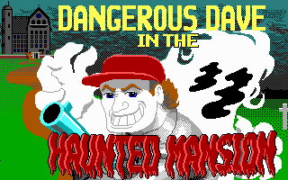
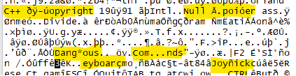

While reminiscing about my youth – spent not with an NES, but with a stack of
floppy disks containing shareware titles and a 486 – I found myself wondering
how difficult it would be to attempt to decompile and reimplement one of those
games for a modern system.

Given the ubiquity of MS-DOS emulation via [DOSBox](https://www.dosbox.com/)
there's not a strong reason to do this; the Internet Archive has a huge [MS-DOS
software library](https://archive.org/details/softwarelibrary_msdos_games) that
can be played directly in your browser.

However as an exercise in dabbling with decompilation and reverse engineering,
it seemed to have a lot of appealing properties.  MS-DOS itself is a relatively
simple and well documented operating system.  The x86 instruction set is still
in service today, runtimes are shallow and easy to spot, and the size of the
codebases themselves are managable for a single person to explore.

## Dangerous Dave in the Haunted Mansion

[Dangerous Dave](https://www.dangerousdave.com/saga) and one of it's sequels
*Dangerous Dave in the Haunted Mansion* (Dave 2) were two of my favourite games
as an 8 year old PC gamer.

Having read *Masters of Doom* a few years ago, I was struck with just how
quickly these games were produced given the hardware limitations of the time.
But even today the quality of these titles is evident.



So I picked Dave 2, probably just because it's aesthetic and gameplay are a
little more appealing to me than the simplicity of it's predecessor.  With a
game selected, I started to think about how I might proceed.

## Project goals

This project is not aiming to be an accurate port.  The goal is to have a
functioning version of the game written in modern, portable C that aims for
roughly 95% implementation of the original.

The missing 5% will be all the stuff that comes from interacting with a MS-DOS
system, so timings may vary, sound will be an interesting problem, and the
structure of the code will be significantly different.

The project will not ship any proprietary assets, and only ship a clean-room
implementation of the game that will execute and load the original source
assets. [^1]

But at it's core, this project is really just about revisiting and refreshing
some older skills that I've become nostalgic for, as well as developing a few
new skills:

1. Writing modern, portable C software.
2. Reading and understanding assembly.
3. Decompilation and reverse-engineering.

Even if this project never ships, re-engaging with technology through these
skills will be valuable in and of itself.

## First steps

Securing the shipped files is simple enough from various online sources.

```text
Mode                 LastWriteTime         Length Name
----                 -------------         ------ ----
-a---          15/02/2026  1:53 AM             14 CTLPANEL.DD2
-a---           7/05/2025  8:46 PM          84222 DAVE.EXE
-a---           7/05/2025  8:41 PM          20714 DOCSHELL.EXE
-a---           7/05/2025  8:41 PM         109824 EGATILES.DD2
-a---           7/05/2025  8:41 PM           3664 INSTRUCT.TXT
-a---           7/05/2025  8:41 PM           3525 INTRO.DD2
-a---           7/05/2025  8:41 PM           2874 LEVEL01.DD2
-a---           7/05/2025  8:41 PM           5532 LEVEL02.DD2
-a---           7/05/2025  8:41 PM           9268 LEVEL03.DD2
-a---           7/05/2025  8:41 PM            616 LEVEL04.DD2
-a---           7/05/2025  8:41 PM           9354 LEVEL05.DD2
-a---           7/05/2025  8:41 PM           5248 LEVEL06.DD2
-a---           7/05/2025  8:41 PM           9156 LEVEL07.DD2
-a---           7/05/2025  8:41 PM           1622 LEVEL08.DD2
-a---           7/05/2025  8:41 PM            154 MENU.SHL
-a---           7/05/2025  8:41 PM          10211 PROGPIC.DD2
-a---           7/05/2025  8:41 PM           3310 QUICK.TXT
-a---           7/05/2025  8:41 PM             96 README.BAT
-a---           7/05/2025  8:41 PM            950 README1.TXT
-a---           7/05/2025  8:41 PM            933 README2.TXT
-a---           7/05/2025  8:41 PM            715 README3.TXT
-a---           7/05/2025  8:41 PM           9844 S_CHUNK1.DD2
-a---           7/05/2025  8:41 PM           9125 S_CHUNK2.DD2
-a---           7/05/2025  8:41 PM          14546 S_DAVE.DD2
-a---           7/05/2025  8:41 PM           8004 S_FRANK.DD2
-a---           7/05/2025  8:41 PM          10420 S_MASTER.DD2
-a---           7/05/2025  8:41 PM           6550 STARPIC.DD2
-a---           7/05/2025  8:41 PM            163 START.BAT
-a---           7/05/2025  8:41 PM          32008 TITLE1.DD2
-a---           7/05/2025  8:41 PM          32008 TITLE2.DD2
```

Depending on where you source the files from there may some some additional
files, but near as I can tell this is a fairly complete listing.

So at this point knowing absolutely nothing about decompilation, my first
instinct is just to open `DAVE.EXE` in a hex editor and see what I can see.
DOS-era text strings _should_ just be ASCII, so at a minimum I'm expecting that
I will be able to browse through the executable and find various strings related
to the game.

The first 2 bytes being MZ apparently indicates that this is an executable in
the [MS-DOS MZ executable
format](https://en.wikipedia.org/wiki/DOS_MZ_executable).  Something to probably
read through later.

But browsing through the rest of the binary data, there's nothing that stands
out as obviously being a string of ASCII text, however I do notice there are
some things that look like they _might_ be text with some obscure encoding.



Huh, well that's disheartening, an immediate road-block.  A quick search for
some of these "strings" doesn't reveal anything obvious.  But it turns out
there's a common trick DOS engineers used to ship binaries on 3.5" floppy disks.

[More to come&hellip;](../dave-2-2-unpack/dave-2-2-unpack.md)

[^1]: the feasibility of this remains to be seen, since at least some amount
of data is encoded in the executable directly
